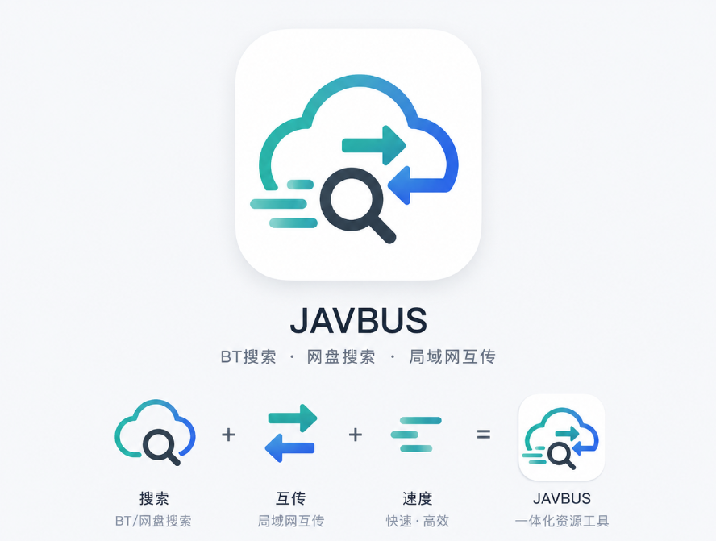

<div align="center">
  
</div>

<h1 align="center">JAVBUS</h1>

JAVBUS 是一款基于 JSON 插件的磁力资源搜索器，同时集成网盘搜索、收藏管理和局域网文件/文本互传功能。

- **磁力搜索**：通过用户自行安装的 JSON 插件接入搜索源，软件本身不内置任何资源站插件。
- **搜盘**：支持配置自部署的 [PanSou](https://github.com/fish2018/pansou) API 服务地址与密钥。
- **收藏**：统一管理磁力链接、网盘链接和普通链接。
- **局域网互传**：自动发现局域网内设备，支持发送文本或文件。

## 为什么用 JAVBUS 搜索 BT 资源？

| 功能 | JAVBUS | qBittorrent Search Plugins | Jackett |
|------|--------|----------------------------|---------|
| BT 资源搜索 | ✅ | ✅ | ✅ |
| 插件化架构 | ✅ | ✅ | ❌ |
| 声明式插件格式 | JSON | Python  |  C# 索引器 |
| 无需编程即可写插件 | ✅ | ❌ | ❌ |
| 跨平台支持 | ✅ Flutter | ❌ 仅桌面 | ⚠️ 需要 Web 服务 |
| 移动端友好 | ✅ | ❌ | ⚠️ 需要外部客户端 |
| 第三方插件分发 | ✅ | ⚠️ 限制多 | ❌ |

### 定位说明

- **qBittorrent Search Plugins**：有插件机制，但插件为 Python 代码且深度绑定 qBittorrent，移动端和扩展性有限。
- **Jackett**：聚合了大量索引源，但添加新源需直接修改 Jackett 代码，维护成本高。
- **JAVBUS**：采用轻量声明式 JSON 插件协议，插件可独立分发与热更新，社区贡献门槛低。

简而言之：

> qBittorrent Search Plugins = 种子搜索框架  
> Jackett = 索引源聚合网关  
> JAVBUS = 种子搜索插件生态

## 插件协议

插件协议文档：[docs/json_plugin_v1.md](docs/json_plugin_v1.md)，在线查看体验更佳：https://wep-56.github.io/JAVBUS/

当前 v1 协议支持：

- `GET` 请求
- JSON API 搜索源
- HTML + 正则提取搜索源
- Cloudflare 人机验证弹窗标记
- 发布页解析最新 baseurl
- 多跳发布页支持（发布页域名含多重重定向时，JAVBUS 会沿链路等待解析至最终主站 baseurl）

**适用范围**

当前协议覆盖以下两类站点（实际覆盖率 80% 以上）：

- **HTML 直出搜索页**：`GET /search?...` 响应 body 直接含结果列表，可通过正则解析。
- **JSON API 直出**：`GET /api?...` 返回 JSON，按字段路径取值即可。
- **带发布站/防走丢站**：支持安装时、搜索失败时、手动触发时自动解析发布站域名。

**暂不支持**

- iframe 渲染页面（插件协议刻意选用纯 JSON 格式以防止滥用，iframe 渲染站暂时无法支持）
- URL 内含 iframe 拼接（适配成本较高，暂无计划）

## 网盘搜索

JAVBUS 内置了对 [PanSou](https://github.com/fish2018/pansou) 的 API 调用支持。在「设置」页面配置已部署的 PanSou 服务 URL 及密钥（如有），即可在 JAVBUS 内直接使用网盘搜索。

## 局域网互传

局域网互传模块参考了 [LocalSend](https://github.com/localsend/localsend) 的产品思路与局域网发现/传输架构，基于轻量自定义协议实现：UDP 广播发现设备，本地 HTTP 接收文本和文件，历史记录仅保存必要元数据。

- 局域网内自动发现设备，支持托盘与后台持续运行
- 无需配对，即开即用

## 开发验证

```powershell
flutter pub get
flutter analyze --no-pub
flutter test --no-pub
flutter build windows --debug --no-pub
flutter build apk --debug --no-pub
```

## 社区

本项目在 [Linux.do](https://linux.do/) 发布与讨论——[一个真诚、友善、团结、专业的技术交流社区](https://linux.do/)。

## License

MIT